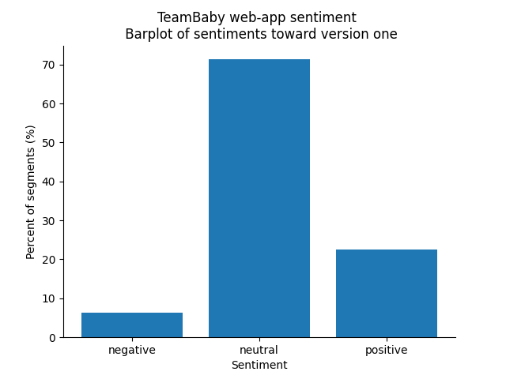
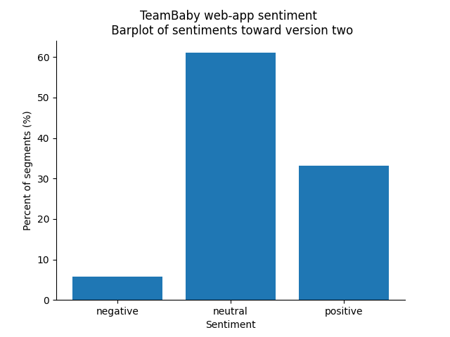

```{r setup, include=FALSE}
knitr::opts_chunk$set(echo = TRUE)
```

## Sentiment analysis

Sentiment analysis was carried out using the TextBlob library in python.  

It uses a pretrained classifier to assign each segment of text a polarity score and a subjectivity score.  
The polarity score ranges between -1 (negative sentiment) to +1 (positive sentiment). A score of 0 is considered neutral. The subjectvity score ranges between 0 and 1, and reflects the degree to which a segment of text reflects personal opinion; values closer to 1 are more likely to be an opinion as opposed to a fact.   

The accuracy and the capabilities of the model are partly due to the volume of text it has been trained on. 
It has been trained using a large body of text in German to assign polarity scores to segements. However, the model is yet to be trained to assign subjectivity scores.

The two visualisations demonstrate the split of sentiments in the qualitative text available on version one and version two of the web-app. When looking at the polarity scores, the average sentiment scores for versions one and two were 0.14 and 0.22; indicating that there was an increase in positive sentiment toward the web-app after incorporating end user feedback.





## Topic Modelling

Topic modelling was carried out using Latent Dirichlet Allocation. At a high level, this approach breaks down a series of documents (e.g. transcripts) into a large 'bag' of words. These words are iteratively grouped together in different ways until the model arrives at what it believes is an optimum allocation of words to topics. The steps of the method are as follows:  

  1) Data is pre-processed, which includes:  
    i) tokenizing (converts the sentences into data that the machine can read)  
    ii) stopping (removing commonly occuring words in speech that are not of interest in assiging for the analysis e.g. ja, okay, genau)  
    iii) stemming (taking the root word)  
    
  2) A number of topics is specified for the modelling. This is based on reading a sample of the transcrtipts, the interview guide or some other informed prior. In this particular instance, two topics were selected after translating and reading a sample of transcripts- common areas of conversation were either about the web-app or experiences of receiving obstetric are.  
  
  3) For each document from 1 to D, the model randomly assigns a topic ID to each word  
  
  4) For each document and word combination:  
    i) the model calculates the dominance of a topic within a given document after removing the word  
    ii) the model calculates the dominance of a word within each topic. that is, what proportion of documents are added to the topic because of the word in question.  
    iii) the probability of the word belonging to the topic is updated  
    iv) The topics are reassigned based on the updated probabilities  
  
  5) Step 4 is repeated multiple times until the probability of a word belonging to a topic converges
### Interpreting the visualisations

#### Interpreting the map:  
  
  -	Area of the circles is proportional to the amount of words that belong the topic  
  -	Distance between circles reflects similarity commonality of words between topics. Topics further apart have fewer words in common.  

#### Interpreting the bar chart:  
  
  -	When no topic is selected:  
      - Bar chart shows the 30 most ‘salient’ terms  
      - Bars reflect the frequency of terms across entire body of text  
  -	When a topic is selected:  
      - The bar chart changes to display most salient terms for the topic selected  
      - The lighter bar reflects the frequency across entire body of text  
      - The darker bar reflects the frequency of the word the topic selected (i.e. if the dark bar eclipses the light bar, the term exclusively belongs to the topic selected)

#### Adjusting the lambda metric:  
  
  - After selected a topic, you can play around with the slider (the lambda metric)  
  - The slider changes the order of the words in the bar chart  
  - The slider is used to help define the topic in question  
  - From a technical perspective, the slider will influence how words are prioritised for a given topic  
    - Values close to 1 will prioritise values that are frequently occurring across the body of text  
    - Values closer to 0  will prioritise rare words that are more exclusive to the topic in question  
    - The developers of this data visual recommend a value of around 0.6 to help in interpret the topic	

#### Help from Margrit and Sonia:  

  - If you have time, can you please adjust the lambda metric to see if there are clear topics titles that come up for topics 1 and 2. That is, based on the words assigned to each topic - do you see a theme popping up?

#### Topic model output for version one feedback: 

```{r, echo = FALSE}
htmltools::includeHTML("images/ldavis_app_v1.html")
```

#### Topic model output for version two feedback: 

```{r, echo = FALSE}
htmltools::includeHTML("images/ldavis_app_v2.html")
```
